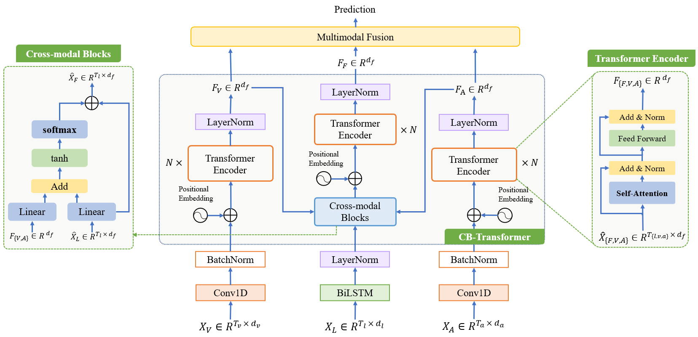
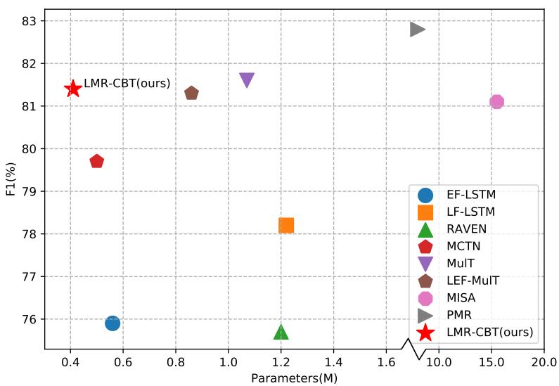

# LMR-CBT: Learning Modality-fused Representations with CB-Transformer for Multimodal Emotion Recognition from Unaligned Multimodal Sequences

> Pytorch implementation for Learning Modality-fused Representations with CB-Transformer for Multimodal Emotion Recognition from Unaligned Multimodal Sequences.

## Overview

### Overall Architecture

In this paper, we propose a neural network to learn modality-fused representations with CB-Transformer (LMR-CBT) for multimodal emotion recognition from unaligned multimodal sequences. Specifically, we first perform feature extraction for the three modalities respectively to obtain the local structure of the sequences. Then, we design a novel transformer with cross-modal blocks (CB-Transformer) that enables complementary learning of different modalities, mainly divided into local temporal learning, cross-modal feature fusion and global self-attention representations. In addition, we splice the fused features with the original features to classify the emotions of the sequences. Finally, we conduct word-aligned and unaligned experiments on three challenging datasets, IEMOCAP, CMU-MOSI, and CMU-MOSEI. The experimental results show the superiority and efficiency of our proposed method in both settings. Compared with the mainstream methods, our approach reaches the state-of-the-art with a minimum number of parameters.

### Datasets

Data files (containing processed MOSI, MOSEI and IEMOCAP datasets) can be downloaded from [here](https://www.dropbox.com/sh/hyzpgx1hp9nj37s/AAB7FhBqJOFDw2hEyvv2ZXHxa?dl=0).

To retrieve the meta information and the raw data, please refer to the [SDK for these datasets](https://github.com/A2Zadeh/CMU-MultimodalSDK).

### Run the Code

1. Create (empty) folders for data and pre-trained models:
~~~~
mkdir data pre_trained_models
~~~~

and put the downloaded data in 'data/'.

2. Command as follows
~~~~
python main.py [--FLAGS]
~~~~

Note that the defualt arguments are for unaligned version of MOSEI. For other datasets, please refer to Supplmentary.

### If Using CTC

Transformer requires no CTC module. However, as we describe in the paper, CTC module offers an alternative to applying other kinds of sequence models (e.g., recurrent architectures) to unaligned multimodal streams.

If you want to use the CTC module, plesase install warp-ctc from [here](https://github.com/baidu-research/warp-ctc).

The quick version:
~~~~
git clone https://github.com/SeanNaren/warp-ctc.git
cd warp-ctc
mkdir build; cd build
cmake ..
make
cd ../pytorch_binding
python setup.py install
export WARP_CTC_PATH=/home/xxx/warp-ctc/build
~~~~

### Result

## Reference

+ Note that some codes references [MulT](https://github.com/yaohungt/Multimodal-Transformer)
